# Laravel 13 Boilerplate

A production-ready Laravel starter kit built for developers who need **full control** over their application — not an opinionated admin panel.

This boilerplate generates clean, conventional Laravel code (controllers, Blade views, form requests) that you own and can freely customize without being locked into a third-party component ecosystem. It follows a strict **Repository Pattern** architecture, ships with server-side DataTables, and includes a complete testing suite (Pest, Dusk, K6) — giving you a solid foundation for long-term, maintainable applications.

## Tech Stack

| Layer | Package | Version |
|---|---|---|
| Runtime | PHP | 8.4 |
| Framework | Laravel | v13 |
| Auth | Laravel Fortify | v1 |
| Testing | Pest | v4 |
| Browser Tests | Laravel Dusk | — |
| Frontend | Tailwind CSS | v4 |
| Bundler | Vite | — |
| Code Style | Laravel Pint | v1 |

---

## Screenshots

### Landing Page
The public entry point with a hero section, application branding, and navigation links that adapt based on authentication state.


### Authentication

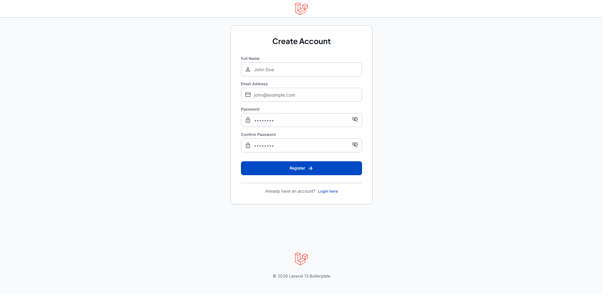


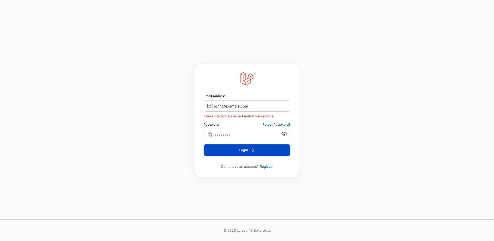

### Email Verification & Password Recovery

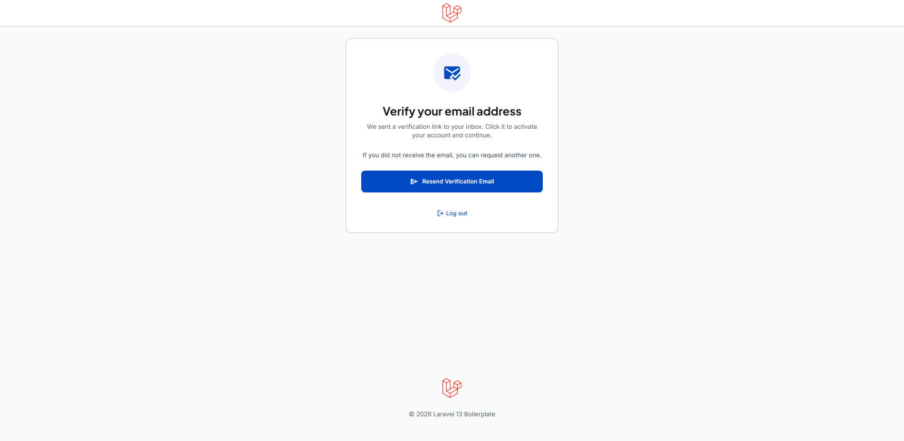

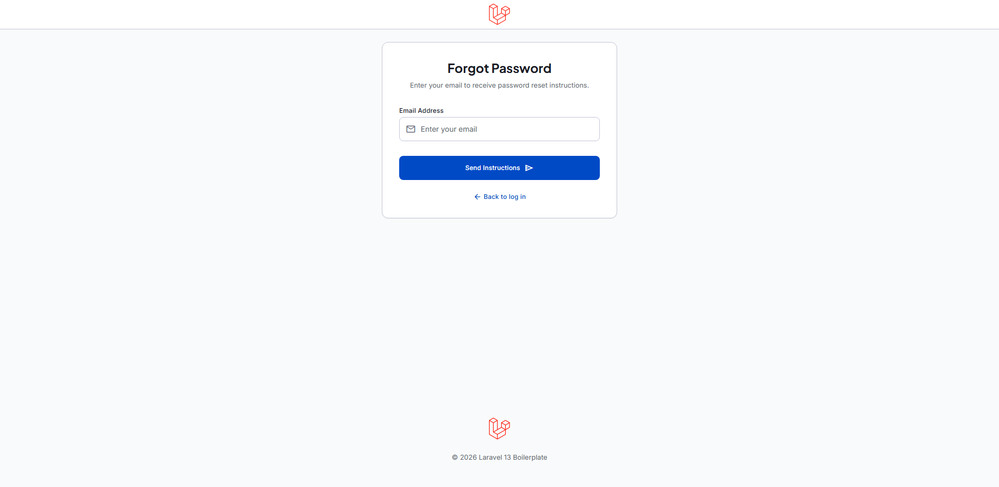


### Dashboard & Profile

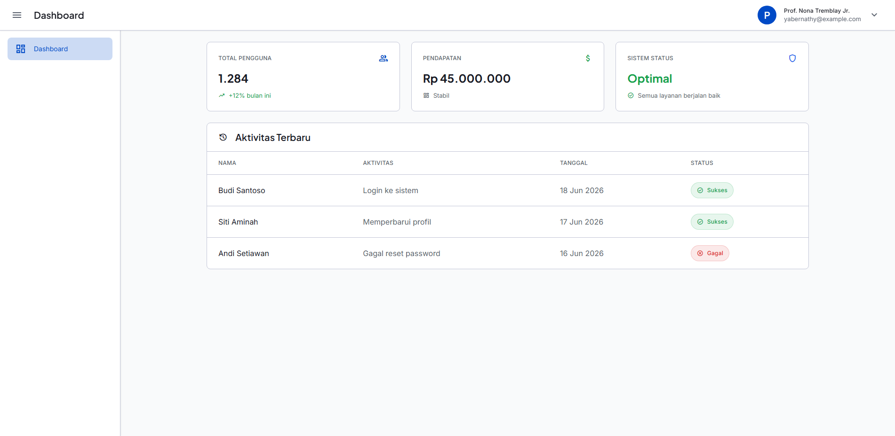

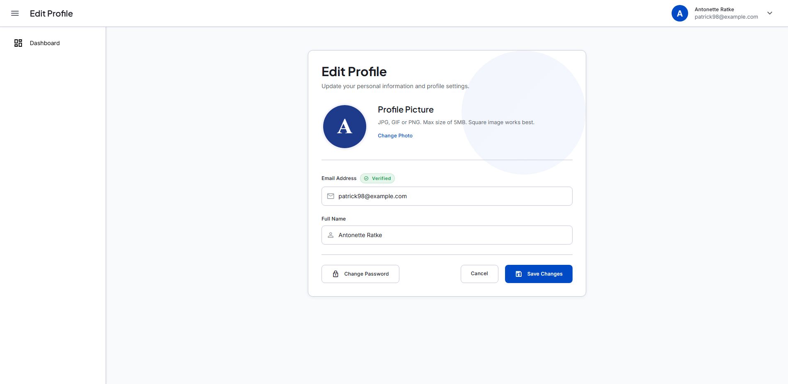

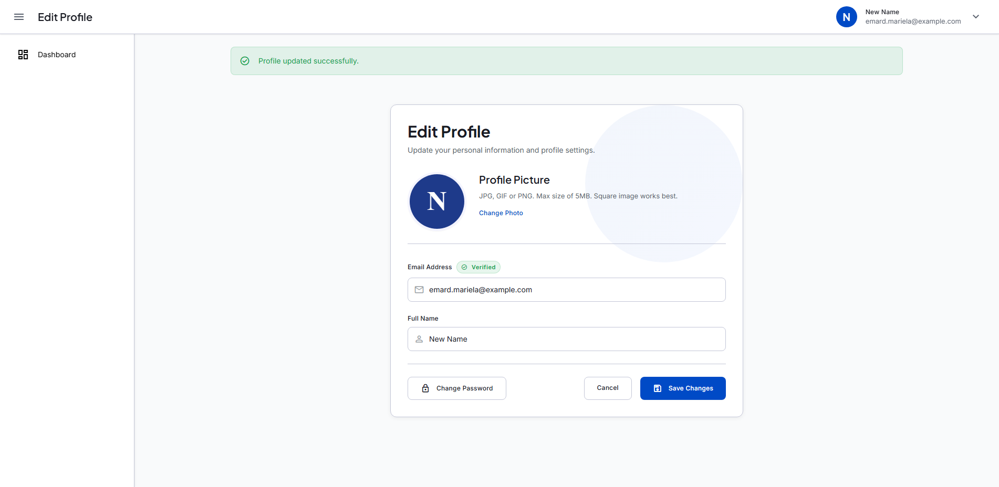

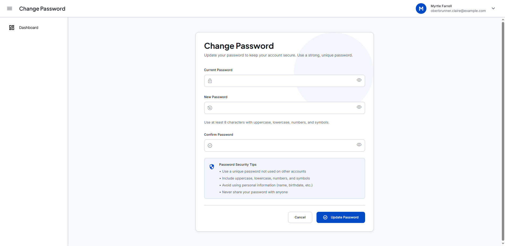

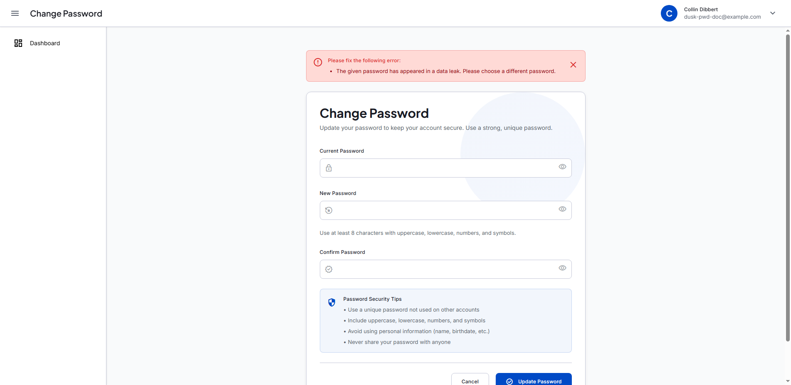

---

## Features Overview

### Authentication

Full authentication flow powered by **Laravel Fortify**:

- **Registration** — with real-time password strength validation (uppercase, lowercase, number, symbol)
- **Login** — email + password with credential error feedback
- **Email Verification** — required before accessing protected routes; resend link supported
- **Forgot Password** — send reset link via email
- **Password Reset** — secure token-based reset with the same password policy as registration
- **Logout** — session termination with redirect to login

> End-user walkthrough with screenshots: [`docs/USERGUIDE.md`](docs/USERGUIDE.md)

---

### Profile Management

Authenticated users can manage their account from the profile page:

- **Update profile** — change name and email address
- **Email change flow** — changing email triggers a re-verification step before the new address is applied
- **Change password** — requires current password; shows animated loading state and success/error feedback

---

### CRUD Generator (`make:rsc`)

A custom Artisan command that scaffolds a complete CRUD module in seconds:

```bash
php artisan make:rsc Product --label="Products"
```

**What gets generated automatically:**

- Eloquent Model + Migration
- Repository Interface & Implementation
- Service Layer
- Controller (with list API endpoint for DataTables)
- Form Requests (Store + Update)
- Blade Views: `index`, `create`, `edit`, `show`
- RESTful routes
- Sidebar menu item

#### Generated Output


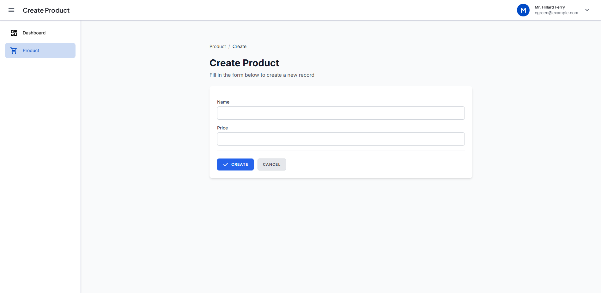

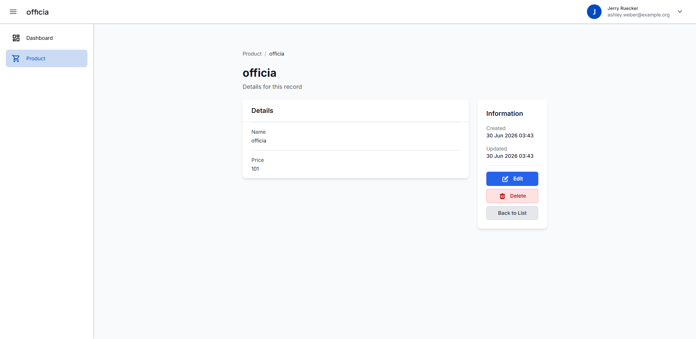

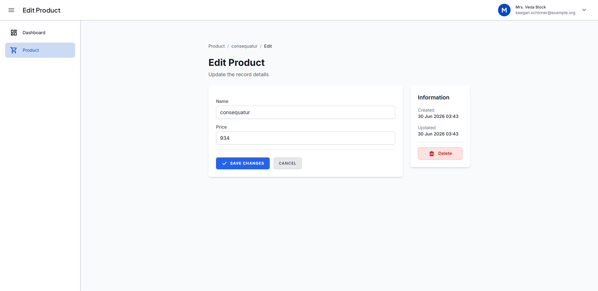

To delete a generated module:

```bash
php artisan delete:rsc Product
```

> Visual showcase with architecture diagrams: [`docs/CRUD_GENERATOR_SHOWCASE.md`](docs/CRUD_GENERATOR_SHOWCASE.md)  
> Full command reference with column configuration: [`docs/CRUD_GENERATOR.md`](docs/CRUD_GENERATOR.md)

---

### DataTables Integration

Generated index pages use server-side DataTables via a dedicated API endpoint (`/route/data/list`):

- Server-side AJAX loading
- Column sorting
- Global search
- Configurable rows-per-page pagination
- Edit / View / Delete action buttons
- Dark mode compatible

> Integration details and customization: [`docs/DATATABLE_INTEGRATION.md`](docs/DATATABLE_INTEGRATION.md)

---

### Repository Pattern Architecture

All entities (both generated and manual) follow a strict **Repository Pattern**:

```
Controller → Service → Repository Interface → Repository Implementation
```

- Decouples business logic from data access
- Makes unit testing straightforward (swap implementations via DI)
- Enforced consistently across the codebase via `AppServiceProvider` bindings

> Architecture guide and implementation examples: [`docs/REPOSITORY_PATTERN.md`](docs/REPOSITORY_PATTERN.md)

---

### Testing Infrastructure

| Type | Tool | Command |
|---|---|---|
| Feature / Unit | Pest v4 | `php artisan test --compact` |
| Browser (E2E) | Laravel Dusk | `php artisan dusk` |
| Performance | K6 | `k6 run tests/k6/<file>` |

> Dusk setup and browser test guide: [`docs/dusk/TESTING.md`](docs/dusk/TESTING.md)

---

## Quick Start

### Prerequisites

- PHP 8.3+
- Composer
- Node.js 18+
- MySQL (or SQLite for local dev)

### Installation

```bash
git clone https://github.com/fakhranfh/laravel-13-boilerplate
cd laravel-13-boilerplate
composer install
npm install
```

### One-command setup

```bash
composer run setup
```

This copies `.env.example` → `.env`, generates the app key, runs migrations, and builds frontend assets.

### Start development servers

```bash
composer run dev
```

Starts PHP server, queue listener, and Vite dev server concurrently.

---

## Common Commands

```bash
# Development
composer run dev          # Start all servers
php artisan pail          # Stream logs in real-time

# CRUD scaffolding
php artisan make:rsc ModelName --label="Label"
php artisan delete:rsc ModelName

# Testing
php artisan test --compact
php artisan dusk

# Code style
vendor/bin/pint --dirty   # Fix formatting on changed files

# Database
php artisan migrate
php artisan db:seed
```

---

## Environment Variables

Key variables to configure in `.env`:

```env
APP_NAME="Laravel 13 Boilerplate"
APP_URL=http://localhost:8000

DB_CONNECTION=mysql
DB_DATABASE=laravel-13-boilerplate

MAIL_MAILER=log        # Use 'smtp' in production
SESSION_DRIVER=database
QUEUE_CONNECTION=database
```

---

## Documentation

| Document | Description |
|---|---|
| [`docs/GETTING_STARTED.md`](docs/GETTING_STARTED.md) | **Complete setup and development guide (start here)** |
| [`docs/USERGUIDE.md`](docs/USERGUIDE.md) | End-user feature walkthrough with screenshots |
| [`docs/CRUD_GENERATOR_SHOWCASE.md`](docs/CRUD_GENERATOR_SHOWCASE.md) | `make:rsc` generated output — screenshots and architecture |
| [`docs/CRUD_GENERATOR.md`](docs/CRUD_GENERATOR.md) | `make:rsc` command — full reference |
| [`docs/REPOSITORY_PATTERN.md`](docs/REPOSITORY_PATTERN.md) | Architecture guide for the repository layer |
| [`docs/DATATABLE_INTEGRATION.md`](docs/DATATABLE_INTEGRATION.md) | DataTables server-side integration |
| [`docs/DATATABLE_EXAMPLE.md`](docs/DATATABLE_EXAMPLE.md) | DataTables usage examples |
| [`docs/dusk/TESTING.md`](docs/dusk/TESTING.md) | Dusk browser test setup and guide |

---

## License

MIT — see [LICENSE](LICENSE).
