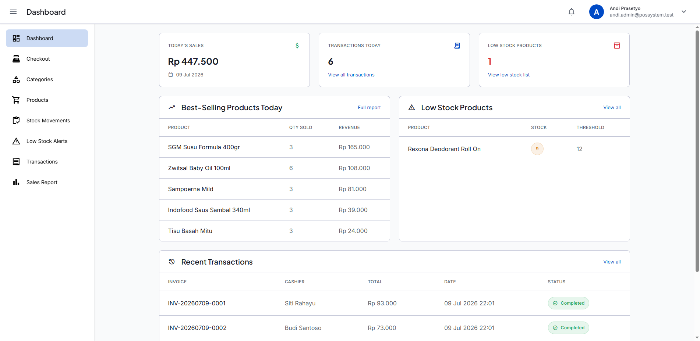
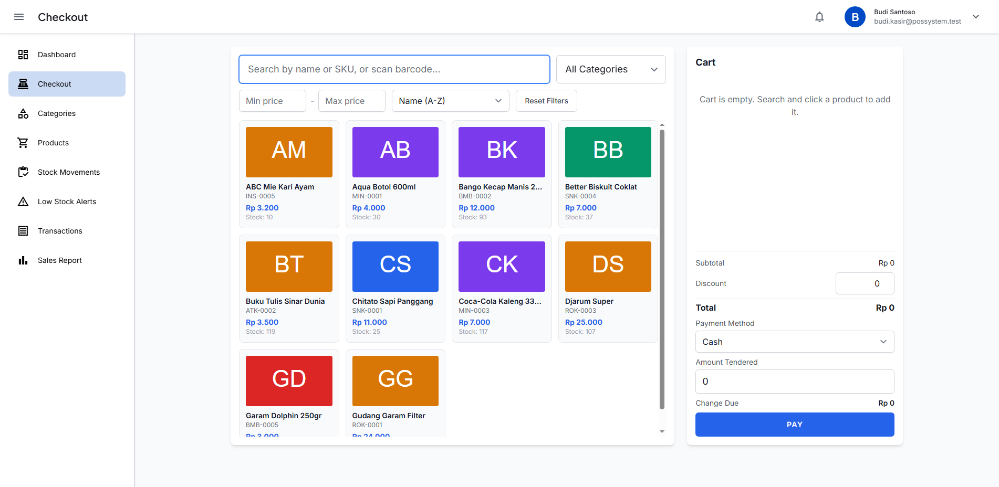
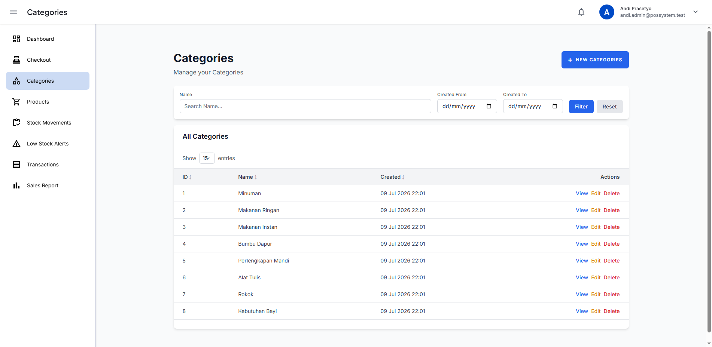
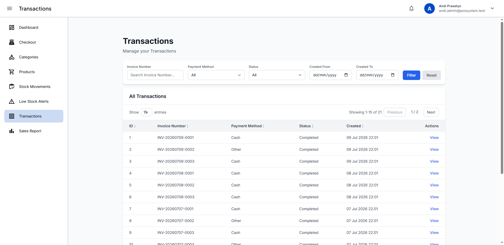
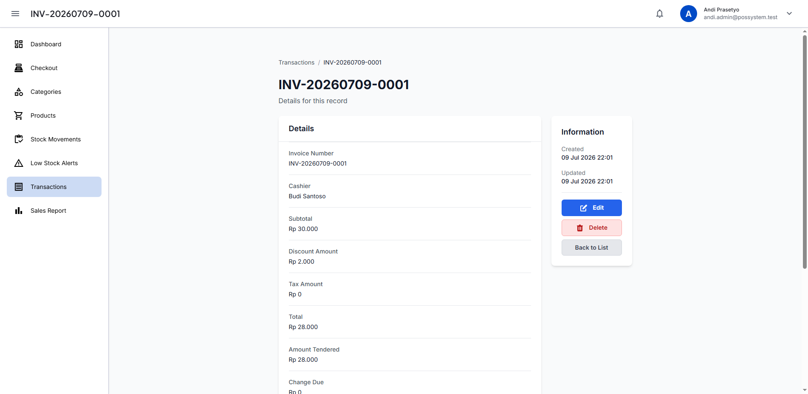
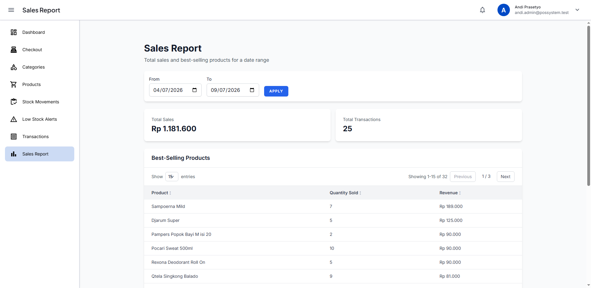

<p align="center">
  
</p>

<h1 align="center">POS — Point of Sale</h1>

<p align="center">A web-based Point of Sale application built on Laravel 13 for small-to-medium retail and F&amp;B businesses.</p>

Cashiers run a register-style checkout — search/add products, apply discounts, take payment, calculate change — while admins manage the product catalog, stock, and sales reports, all from the browser.

> [!NOTE]
> This project follows the Repository Pattern and CRUD generator conventions inherited from its [Laravel 13 boilerplate](https://github.com/fakhranfh/laravel-13-boilerplate) foundation. See [docs/PRD_POS_CORE_FEATURES.md](docs/PRD_POS_CORE_FEATURES.md) for the full product spec.

## Tech stack

| Layer | Package | Version |
|---|---|---|
| Runtime | PHP | 8.4 |
| Framework | Laravel | v13 |
| Auth | Laravel Fortify | v1 |
| Testing | Pest | v4 |
| Browser tests | Laravel Dusk | — |
| Frontend | Tailwind CSS | v4 |
| Bundler | Vite | — |
| Code style | Laravel Pint | v1 |

## Features

- **Product & category management** — SKU, price, cost, stock, image, category, soft-deletable to preserve transaction history
- **Inventory tracking** — stock movements (sale, stock-in, adjustment, return) and low-stock alerts
- **Cashier checkout** — cart, quantity adjustment, discounts, payment, change calculation
- **Transaction history** — filterable list with line-item detail per sale
- **Sales reporting** — date-range totals and best-selling products
- **Role-based access** — Admin and Cashier roles via Laravel Fortify

> [!IMPORTANT]
> This is an MVP: single-outlet scope, cash/manual payment only (no payment gateway integration), no offline support. See [docs/PRD_POS_CORE_FEATURES.md](docs/PRD_POS_CORE_FEATURES.md#2-goals--success-metrics) for anti-goals and Phase 2 plans.

## Screenshots



| Checkout | Category list |
|---|---|
|  |  |

| Transaction list | Transaction detail | Sales report |
|---|---|---|
|  |  |  |

> [!TIP]
> These are captured automatically by the Dusk suite (see [docs/dusk/TESTING.md](docs/dusk/TESTING.md)). Run `php artisan dusk` after UI changes to refresh them.

## Architecture

Every entity follows a strict layered pattern:

```
Controller → Service → Repository Interface → Repository Implementation
```

New entities are scaffolded with the built-in CRUD generator:

```bash
php artisan make:rsc ModelName --label="Label"
```

This generates the model, migration, repository, service, controller, form requests, and Blade views (index/create/edit/show) in one step. See [docs/CRUD_GENERATOR.md](docs/CRUD_GENERATOR.md) and [docs/REPOSITORY_PATTERN.md](docs/REPOSITORY_PATTERN.md) for details.

## Quick start

### Prerequisites

- PHP 8.4
- Composer
- Node.js 18+
- MySQL (or SQLite for local dev)

### Installation

```bash
git clone <repo-url>
cd pos
composer run setup
```

`composer run setup` installs dependencies, copies `.env.example` to `.env`, generates the app key, runs migrations, and builds frontend assets.

### Start development servers

```bash
composer run dev
```

Runs the PHP server, queue listener, and Vite dev server concurrently.

## Common commands

```bash
# Development
composer run dev              # Start all servers
php artisan pail              # Stream logs in real-time

# CRUD scaffolding
php artisan make:rsc ModelName --label="Label"
php artisan delete:rsc ModelName

# Testing
php artisan test --compact
php artisan dusk

# Code style
vendor/bin/pint --dirty        # Fix formatting on changed files

# Database
php artisan migrate
php artisan db:seed
```

## Documentation

| Document | Description |
|---|---|
| [docs/PRD_POS_CORE_FEATURES.md](docs/PRD_POS_CORE_FEATURES.md) | Product requirements: scope, data models, API surface, acceptance criteria |
| [docs/GETTING_STARTED.md](docs/GETTING_STARTED.md) | Complete setup and development guide |
| [docs/USERGUIDE.md](docs/USERGUIDE.md) | End-user feature walkthrough with screenshots |
| [docs/CRUD_GENERATOR.md](docs/CRUD_GENERATOR.md) | `make:rsc` command reference |
| [docs/REPOSITORY_PATTERN.md](docs/REPOSITORY_PATTERN.md) | Architecture guide for the repository layer |
| [docs/DATATABLE_INTEGRATION.md](docs/DATATABLE_INTEGRATION.md) | Server-side DataTables integration |
| [docs/dusk/TESTING.md](docs/dusk/TESTING.md) | Dusk browser test setup and guide |

## License

MIT — see [LICENSE](LICENSE).
